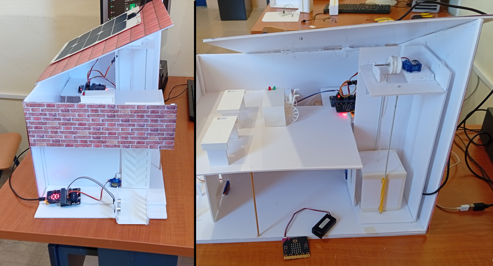

# Designing Schools for All

  

Η ομάδα ρομποτικής του σχολείου μας, 5ο Λύκειο Αγρινίου, ευαισθητοποιημένη απέναντι στις προκλήσεις που αντιμετωπίζουν τα άτομα με κινητικά προβλήματα, συμμετέχει φέτος στον διαγωνισμό με στόχο τον σχεδιασμό και την ανάπτυξη καινοτόμων λύσεων για τη βελτίωση της <b>προσβασιμότητας και της αυτονομίας</b> στον σχολικό χώρο.

Στην πρόταση περιλαμβάνεται ένα σύστημα ανύψωσης αμαξιδίων στο όροφο όπου υπάρχουν τα εργαστήρια πληροφορικής και φυσικών επιστημών. Οι πόρτες από τις οποίες θα περνάει το αμαξίδιο θα ανοίγουν αυτόματα επιτρέποντας την εύκολη πρόσβαση, προσθέτοντας όπου απαιτείται ράμπες. Η απαιτούμενη ενέργεια θα παράγεται από Φ/Β σύστημα. Στη θέση/θρανίο όπου θα πηγαίνει το άτομο με το αμαξίδιο θα μπορούσε να υπάρχει σταθμός επαναφόρτισης του αμαξιδίου.

  
Υλικά που θα χρειαστούμε :
 
<ul>
<li>BBC Micro:bit V2 Board x 2</li>
<li>Edge Connector Breakout Board x 2</li>
<li>Πλακέτα Δοκιμών x 2</li>
<li>Jumper Wires F-M x 3</li>
<li>Jumper Wires 15cm Μ-Μ x 3</li>
<li>Ribbon 40wire 20cm - Female to Μale x 3</li>
<li>Ribbon 40wire 20cm - Male to Male x 3</li>
<li>Ribbon 40wire 20cm - Female to Female x 3</li>
<li>LED Red Diffused 5mm & Resistor 200Ω x 1</li>
<li>LED Green Diffused 5mm & Resistor 200Ω x 1</li>
<li>LED Yellow Diffused 5mm & Resistor 200Ω x 1</li>
<li>Servo (μικρά) x 3</li>
<li>Feetech FS90R Continuous Rotation x 3</li>
<li>Ultrasonic Sensor x 3</li>
<li>3D Printer Filament x 1</li>
<li>DFRobot Solar Panel 5V 1A with Voltage Regulator x 1</li>
<li>DC Gear Motor TT - 130 RPM (With Wire) x 2</li>
<li>Alligator Test Leads - Multicolored x 1</li>
</ul>

  
<table style="border: 3px solid; box-shadow: 10px 10px lightblue;">
<caption style="text-align: center;">Εικόνες από τη κατασκευή</caption>
<tbody>
<tr>
	<td colspan="2"></td>
	<td></td>
</tr>
<tr>
	<td colspan="4" align="center"> </td>
</tr>
<tr>
	<td>
</td>
	<td>
</td>
	<td>
</td>
</tr>
</tbody>
</table>
